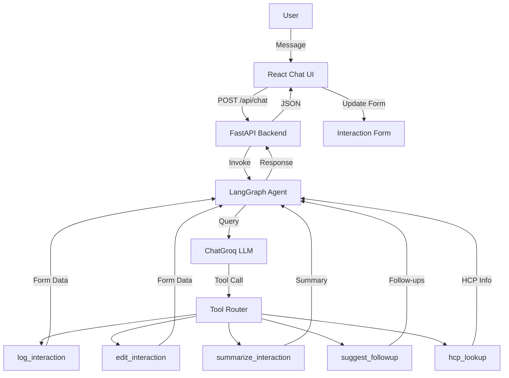

# AI-First CRM HCP Module

[](https://fastapi.tiangolo.com)
[](https://react.dev)
[](https://www.typescriptlang.org/)
[](https://langchain-ai.github.io/langgraph/)
[](https://groq.com)
[](https://python.org)
[](https://vitejs.dev)
[](LICENSE)

An AI-powered Healthcare Professional (HCP) CRM interaction logging system built for pharmaceutical field representatives. Describe your field visit in plain English — the AI extracts structured data, updates the CRM, and suggests follow-up actions — all through a conversational interface backed by LangGraph and Groq.

---

## Project Overview

Pharmaceutical sales representatives visit dozens of doctors weekly and must log each interaction in the CRM. This module eliminates manual data entry by providing two equivalent entry points:

| Entry Point | Description |
|---|---|
| **Structured Form** | Traditional fill-in-the-blanks form with fields for HCP name, interaction type, channel, date, time, attendees, products discussed, sentiment, samples, materials, summary, and follow-ups. |
| **AI Chat Assistant** | Describe the visit in natural language (e.g., *"Today I met Dr. Rajesh at Apollo Hospital and discussed CardioFlow for hypertension. He was very positive and requested efficacy data."*). The LangGraph agent orchestrates tool calls, and the Groq LLM extracts every field automatically. |

Both paths produce identical, auditable CRM records. The form updates in real-time as the AI processes the conversation.

---

## Features

| Feature | Description |
|---|---|
| 🤖 **AI-powered interaction logging** | Natural language → structured CRM entry via LLM extraction |
| 📋 **Structured interaction form** | 13-field form with date, time, attendees, products, sentiment, samples, materials, summary, follow-ups |
| 💬 **Conversational AI assistant** | Chat interface with multi-turn context-aware conversation |
| 🔍 **Automatic entity extraction** | HCP names, product names, dates, times, and actions extracted from free text |
| 🏥 **HCP information extraction** | Doctor name, title, and institution parsed automatically |
| 😊 **Sentiment detection** | Positive / Neutral / Negative inferred from conversational tone |
| 📦 **Material & sample tracking** | Shared materials and distributed samples tracked as structured items |
| 📅 **Follow-up recommendations** | AI suggests next steps and scheduled follow-ups based on the conversation |
| ⚙️ **LangGraph multi-tool agent** | 5 specialized tools orchestrated by a state-graph agent |
| ⚡ **Responsive React UI** | Clean, modern interface built with TypeScript and CSS |
| 🚀 **FastAPI backend** | High-performance async Python backend with auto-generated OpenAPI docs |

---

## Tech Stack

### Frontend

| Technology | Purpose |
|---|---|
| **React 18** | UI framework |
| **TypeScript** | Type-safe development |
| **CSS3** | Styling (no framework — custom design matching recruiter reference) |
| **Vite** | Build tool and dev server |

### Backend

| Technology | Purpose |
|---|---|
| **Python 3.11+** | Runtime |
| **FastAPI** | Async REST API framework |
| **LangGraph** | State-graph AI agent orchestration |
| **LangChain Core** | Tool abstraction and LLM integration |
| **ChatGroq** | `gemma2-9b-it` / `llama-3.1-8b-instant` LLM inference |
| **Pydantic** | Data validation and extraction schemas |

### Database

| Technology | Purpose |
|---|---|
| **PostgreSQL / MySQL** | Production-ready relational DB (prepared schema) |
| **SQLite** | Local development (default) |
| **SQLAlchemy 2.0** | ORM and migrations |

---

## LangGraph Architecture

The system uses a LangGraph `StateGraph` with tool-calling nodes. When a user sends a message, the agent decides which tools to invoke, executes them, and returns structured data to the frontend.

```
┌──────────┐     ┌────────────┐     ┌──────────┐     ┌────────────────┐
│  React   │ ──▶ │  FastAPI   │ ──▶ │ LangGraph│ ──▶ │   ChatGroq     │
│  Chat UI │ ◀── │  Backend   │ ◀── │  Agent   │ ◀── │ (gemma2-9b-it) │
└──────────┘     └────────────┘     └──────────┘     └────────────────┘
                                         │
                                         ▼
                                  ┌──────────────┐
                                  │  Tool Router │
                                  └──────┬───────┘
                                         │
              ┌──────────┬──────────┬─────┴─────┬──────────┬──────────┐
              ▼          ▼          ▼           ▼          ▼
         ┌────────┐ ┌────────┐ ┌────────┐ ┌──────────┐ ┌──────────┐
         │  Log   │ │  Edit  │ │Summarize│ │ Suggest  │ │   HCP    │
         │Interact.│ │Interact.│ │Interact.│ │Follow-up │ │  Lookup  │
         └────────┘ └────────┘ └────────┘ └──────────┘ └──────────┘
```



---

## LangGraph Tools

### 1. Log Interaction

Extracts 13 structured fields (HCP name, type, channel, date, time, products, sentiment, samples, materials, next steps, summary, attendees, raw text) from natural language descriptions using the Groq LLM. This is the primary tool called when a user describes a field visit.

### 2. Edit Interaction

Updates specific fields in an already-logged interaction. The LLM infers which fields changed from the user's edit request (e.g., *"Actually, change the sentiment to Positive"*) and merges only the changed values.

### 3. Summarize Interaction

Creates a concise, professional meeting summary from the extracted interaction data. Useful for quick CRM snapshots or email updates to the management team.

### 4. Suggest Follow-up

Generates AI-powered follow-up recommendations based on the interaction context, including suggested next steps, optimal follow-up timing, and preparatory materials to bring.

### 5. HCP Lookup

Retrieves Healthcare Professional profile information including specialty, institution, segment, and interaction history. Enables the agent to answer questions like *"What did we last discuss with Dr. Mehta?"*

---

## Folder Structure

```
ai-crm-hcp-module/
├── backend/
│   ├── app/
│   │   ├── agent/               # LangGraph graph, tools, LLM wrappers
│   │   │   ├── form_graph.py    # StateGraph definition & nodes
│   │   │   ├── form_tools.py    # LangChain tools + Pydantic schemas
│   │   │   ├── llm.py           # Groq LLM client & prompts
│   │   │   └── state.py         # Interaction state model
│   │   ├── routers/             # FastAPI route handlers
│   │   │   ├── form_agent.py    # Chat/agent endpoint
│   │   │   ├── hcp.py           # HCP CRUD endpoints
│   │   │   └── interactions.py  # Interaction CRUD endpoints
│   │   ├── main.py              # FastAPI application entry
│   │   ├── models.py            # SQLAlchemy ORM models
│   │   ├── schemas.py           # Pydantic API schemas
│   │   ├── config.py            # Environment config
│   │   └── database.py          # Database engine & session
│   ├── seed.py                  # Demo data seeder
│   ├── requirements.txt         # Python dependencies
│   └── .env.example             # Backend environment template
├── frontend/
│   ├── src/
│   │   ├── components/          # React components
│   │   │   ├── Header.tsx       # Top bar with HCP picker
│   │   │   ├── ChatPanel.tsx    # AI chat interface
│   │   │   ├── InteractionForm.tsx  # Structured form
│   │   │   └── *.css            # Component styles
│   │   ├── api/agent.ts         # Backend API client
│   │   ├── types/index.ts       # TypeScript type definitions
│   │   ├── App.tsx              # Root component
│   │   └── main.tsx             # Entry point
│   ├── package.json
│   ├── vite.config.ts
│   └── .env.example             # Frontend environment template
├── docs/
│   ├── architecture.md          # Detailed architecture document
│   └── recruiter-reference.png.png  # Reference UI mockup
├── README.md
├── render.yaml                  # Render deployment config
└── docker-compose.yml
```

---

## Installation

```bash
git clone https://github.com/Murali-Madevan/ai-hcp-crm-agent-by-murali.git
cd ai-crm-hcp-module
```

---

## Backend Setup

```bash
cd backend

# Create virtual environment
python -m venv .venv

# Activate (Windows)
.venv\Scripts\activate

# Activate (macOS / Linux)
source .venv/bin/activate

# Install dependencies
pip install -r requirements.txt

# Configure environment
cp .env.example .env
```

Edit `backend/.env` and set your Groq API key:

```env
GROQ_API_KEY=gsk_your_key_here
```

Seed demo data and start the server:

```bash
python seed.py
uvicorn app.main:app --reload --port 8000
```

API documentation is available at `http://localhost:8000/docs`.

---

## Frontend Setup

```bash
cd frontend
npm install
cp .env.example .env
npm run dev
```

Open `http://localhost:5173` in your browser.

---

## Environment Variables

| Variable | Required | Description |
|---|---|---|
| `GROQ_API_KEY` | Yes | Groq Cloud API key (get one at [console.groq.com](https://console.groq.com)) |
| `DATABASE_URL` | No | Database connection string (defaults to SQLite) |
| `OPENAI_API_KEY` | No | Optional — for OpenAI fallback LLM |

---

## Running the Project

1. **Start the backend** — `cd backend && uvicorn app.main:app --reload --port 8000`
2. **Start the frontend** — `cd frontend && npm run dev`
3. **Open** `http://localhost:5173`
4. **Select an HCP** from the dropdown in the header
5. **Log interactions** by typing in the AI chat panel, e.g.:
   - *"Today I met with Dr. Rajesh Kumar at Apollo Hospital. We discussed CardioFlow for hypertension management. The doctor was very positive about the clinical trial results. I shared brochures and patient education material. The doctor requested additional efficacy data. Schedule a follow-up meeting next Friday."*
6. **Watch** the left-side form populate automatically with extracted data

---

## Screenshots

> Screenshots coming soon. To add your own, place screenshots in `docs/screenshots/` and reference them as `docs/screenshots/dashboard.png`, `docs/screenshots/chat.png`, and `docs/screenshots/form.png`.

---

## Demo Flow

1. **Select HCP** — Choose a doctor from the header dropdown
2. **Enter conversation** — Type your field visit notes in the AI chat panel
3. **AI extracts information** — The Groq LLM parses entities, dates, products, and sentiment
4. **LangGraph executes tools** — The agent routes to `log_interaction` and `suggest_followup`
5. **Form updates automatically** — All 13 fields populate in real-time on the left panel
6. **Edit interaction** — Request changes via chat (e.g., *"Change the sentiment to Neutral"*)
7. **Save interaction** — The completed record is ready for CRM submission

---

## Future Improvements

| Area | Enhancement |
|---|---|
| 🎤 **Voice transcription** | Speech-to-text for hands-free logging after field visits |
| 📅 **Calendar integration** | Auto-schedule follow-ups in Google Calendar / Outlook |
| 📊 **Analytics dashboard** | Rep performance metrics, HCP engagement trends, territory analysis |
| 👥 **Multi-user authentication** | Role-based access for reps, managers, and admins |
| 🔗 **CRM integration** | Bi-directional sync with Salesforce, Veeva, or custom CRM platforms |
| 🌐 **Multi-language support** | Hindi, regional language support for Indian pharmaceutical market |

---

## Author

**Murali Madevan**

[](https://www.linkedin.com/in/murali-madevan/)
[](https://github.com/Murali-Madevan)

---

## License

This project is licensed under the **MIT License** — see the [LICENSE](LICENSE) file for details.
